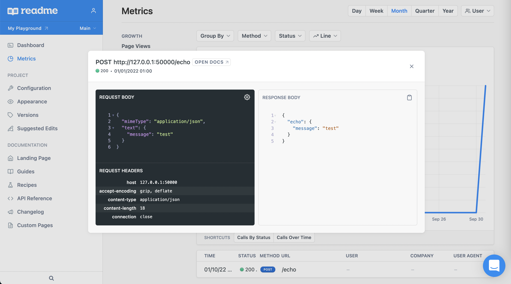

readme-metric-reporter-express / [Exports](modules.md)

# Report Express.js usage to [README.com](https://docs.readme.com/docs/api-metrics-in-readme)

Collect and publish Express.js API usage metrics to README.com

[](https://www.npmjs.com/readme-metric-reporter-express)
[](https://codecov.io/gh/igrek8/readme-metric-reporter-express)


[](https://npm.runkit.com/readme-metric-reporter-express)

## Installation

```bash
npm install --save readme-metric-reporter-express

yarn add readme-metric-reporter-express
```

## View in the dashboard



## [Integration](./runkit.js)

```ts
const express = require('express');
const { MetricReporter, MetricReporterMode } = require('readme-metric-reporter');
const { report } = require('readme-metric-reporter-express');

/**
 * 1) Get your API key here
 *
 * https://dash.readme.com/project/YOUR_PROJECT/v1/api-key
 */

const API_KEY = 'rdme_XXXXXXXXXXXXXXXXXXXXXXXXXXXXXXXXXXXXXXXXXXXXXXXXXXXXXXXXXXXXXXXXXXXXXX';

const reporter = new MetricReporter(API_KEY, {
  buffer: { size: 1 },
  mode: MetricReporterMode.DEVELOPMENT,
});

/**
 * 2) Add error handler in case metrics rejected
 */
reporter.on('error', console.warn);

const collector = {
  collect(_req, _res, metric) {
    return {
      // ... perform filtering of sensitive data
      ...metric,
      // ... assign unique request id
      _id: Math.random().toString(36).substring(2),
    };
  },
};

/**
 * 3) Track usage
 *
 * https://dash.readme.com/project/YOUR_PROJECT/v1/metrics/v2/api-calls
 */
const app = express();
app.use(report({ reporter, collector }));
app.listen(3000);
```
